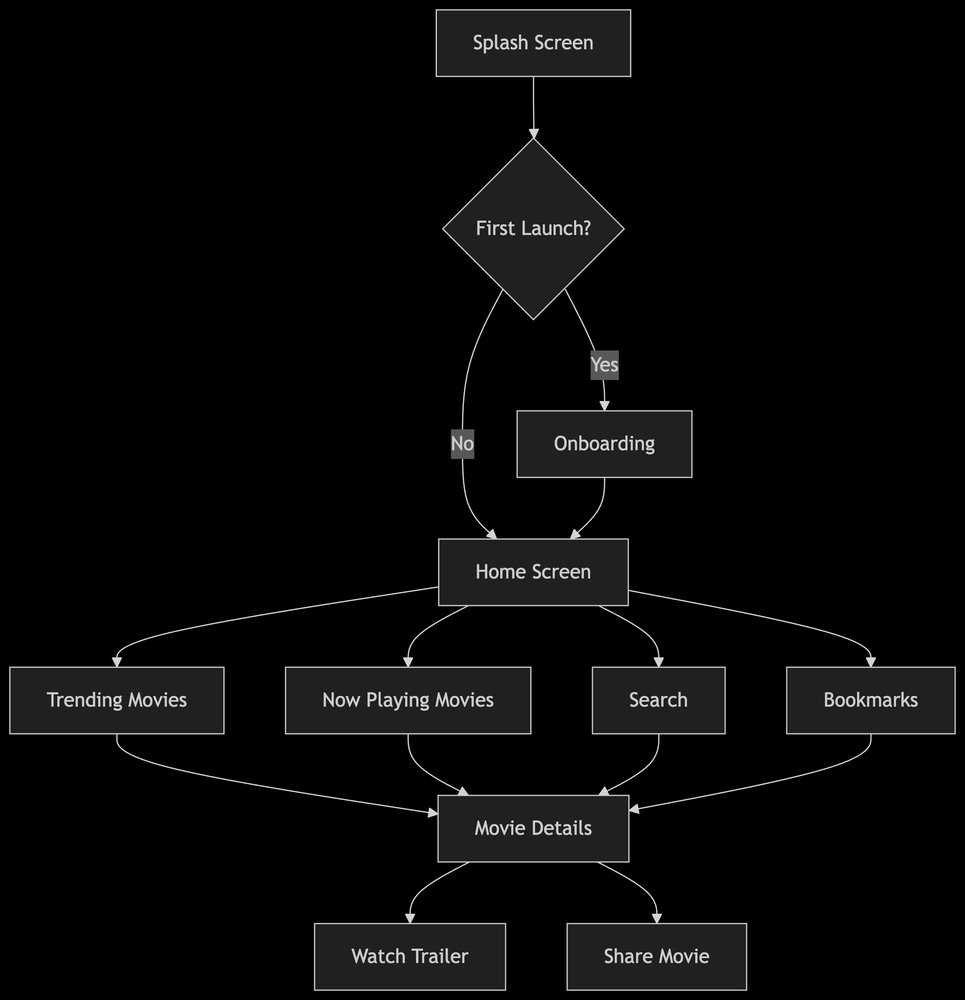

# iMovieX - Movie Discovery App 🎬🍿

## Overview
iMovieX is a feature-rich Flutter application that allows users to discover trending and now playing movies, view detailed information about movies, bookmark favorites, and search for movies. Built following Clean Architecture principles, it provides a robust and maintainable codebase with excellent offline support through local database caching.

## Setup Instructions

### Prerequisites
1. Flutter SDK (v3.13.0+)
2. Dart SDK (v3.1.0+)

### Configuration

1. Install dependencies:
```bash
flutter pub get
```

2. Generate code:
```bash
flutter pub run build_runner build --delete-conflicting-outputs
```


### Running the App
```bash
flutter run
```


## ⚠️ Important Notes: TMDB API Issues

- The TMDB API can **frequently return Connection Timeout errors** due to their server limitations.
- **Temporary Fix:**  
  Try setting your device's Private DNS to Google's DNS (`dns.google` or `8.8.8.8`) for potentially better connectivity.
    - Go to Wi-Fi settings > Private DNS > set to `dns.google`
- This is not guaranteed; API errors are out of app control. All errors are handled gracefully in-app.


## Features

### Core Functionality
- **Trending & Now Playing Movies**: Discover popular and currently showing movies
- **Movie Details**: Comprehensive information including synopsis, ratings, and trailers
- **Bookmarking**: Save favorite movies locally for offline access
- **Search**: Find movies with real-time search functionality
- **Deep Linking**: Share movies directly to others with app-direct links
- **Offline Support**: Full functionality without internet connection
- **Watch Trailers**: Play movie trailers directly in the app

### Enhanced Experience
- **Splash & Onboarding**: Engaging introduction to the app
- **Responsive UI**: Adapts to different screen sizes and orientations
- **Debounced Search**: Efficient API usage with smart search throttling
- **API Error Handling**: Robust error management and user feedback

## Project Structure (Clean Architecture)
```
lib/
├── core/
│   ├── constants/          # App constants and enums
│   ├── injectable/         # Dependency injection setup
│   ├── routes/             # Application routing configuration
│   ├── services/           # Deep linking, API services
│   ├── utils/              # Helper functions and utilities
│   ├── widgets/            # Reusable UI components
│   ├── network/            # Dio configuration, API clients
│   ├── database/           # Hive database setup and models
│   └── error/              # Custom error handling classes
│
├── features/
│   ├── splash/             # Splash screen implementation
│   ├── onboarding/         # Onboarding screens
│   ├── home/               # Main screen with movie lists
│   │   ├── data/
│   │   │   ├── datasources/ # Local and remote data sources
│   │   │   ├── models/      # Data transfer objects
│   │   │   └── repositories/ # Concrete repository implementations
│   │   ├── domain/
│   │   │   ├── entities/    # Business objects
│   │   │   ├── repositories/ # Abstract repository contracts
│   │   │   └── usecases/    # Business logic components
│   │   └── presentation/
│   │       ├── cubit/       # State management
│   │       └── ui/          # Screens and widgets
│   ├── details/            # Movie details feature
│   ├── bookmarks/          # Bookmark management
│   └── search/             # Movie search functionality
│
├── inshorts_movies_app.dart
└── main.dart               # Application entry point
```

## Technical Implementation

### API Integration
- **Retrofit**: Used for type-safe API communication with TMDB
- **Custom API Logger**: Enhanced request/response logging
- **API Key Management**: Securely stored in .env file
- **Endpoints Implemented**:
  - Trending Movies
  - Now Playing Movies
  - Movie Details
  - Search Movies
  - Movie Videos (for trailers)

### Local Database
- **Hive**: Lightweight and fast NoSQL database
- **Type Adapters**: Automatically generated for models
- **Offline-First Approach**: Data is always served from local DB
- **Automatic Cache Refresh**: New data fetched when online

### State Management
- **Cubit**: Lightweight state management solution
- **BlocProvider**: For dependency injection of cubits
- **State Emission Control**: Precise state updates for performance

### Dependency Injection
- **Injectable**: Code generation for dependency management
- **GetIt**: Service locator for dependency access
- **Modular Setup**: Easy to maintain and extend

### Routing & Navigation
- **GoRouter**: Powerful routing with deep linking support
- **Named Routes**: For easy navigation references
- **Route Guards**: Protection for auth-required routes
- **Deep Link Handling**: Custom scheme support (`imoviex://`)

### Search Implementation
- **Debouncing**: 1000ms delay after typing stops
- **Smart Fetching**: Only searches after 3+ characters
- **Loading States**: Visual feedback during search
- **Pagination**: Support for large result sets

### Deep Linking
```dart
// Sharing implementation
static void shareMovie(int movieId, String movieTitle) {
  final deepLink = 'imoviex:///movie/$movieId';
  Share.share('Check out "$movieTitle" on iMovieX!\n$deepLink');
}

// Deep link handling
static void _handleDeepLink(Uri uri) {
  if (uri.scheme == 'imoviex' && uri.host == 'movie') {
    final movieId = uri.pathSegments[0];
    router.push('/details/$movieId');
  }
}
```
- Shared link opens the app and directly navigates to the movie's detail page.
- For apps like WhatsApp, users may need to **copy and paste** the link into the browser.

> ⚠️ **Note**: These links are not actual web links. Since the `imoviex://` scheme is app-specific, the system will prompt users to open the iMovieX app.


## App Flow



## Known Issues
1. TMDB API occasionally times out (mitigated by retry logic)
2. Deep links require copying full URL when sharing via some platforms
3. Limited trailer availability for some movies

## Future Enhancements
- User authentication system
- Movie recommendations based on preferences
- Ratings and reviews system
- Social sharing integration
- Internationalization support
- Accessibility improvements

## Dependencies
```yaml
dependencies:
  flutter:
    sdk: flutter
  dio: ^5.4.0
  retrofit: ^4.0.1
  get_it: ^7.6.4
  injectable: ^2.1.0
  hive: ^2.2.3
  hive_flutter: ^1.1.0
  go_router: ^13.0.0
  share_plus: ^7.0.1
  app_links: ^2.1.0
  flutter_dotenv: ^5.1.0
  youtube_player_flutter: ^8.1.2
  equatable: ^2.0.5
  flutter_bloc: ^8.1.3

dev_dependencies:
  build_runner: ^2.4.8
  retrofit_generator: ^4.0.0
  injectable_generator: ^2.1.1
  hive_generator: ^2.0.1
```

## Contribution
Contributions are welcome! Please follow these steps:
1. Fork the repository
2. Create your feature branch (`git checkout -b feature/AmazingFeature`)
3. Commit your changes (`git commit -m 'Add some AmazingFeature'`)
4. Push to the branch (`git push origin feature/AmazingFeature`)
5. Open a Pull Request

---
**Enjoy discovering movies with iMovieX!** 🎬🍿